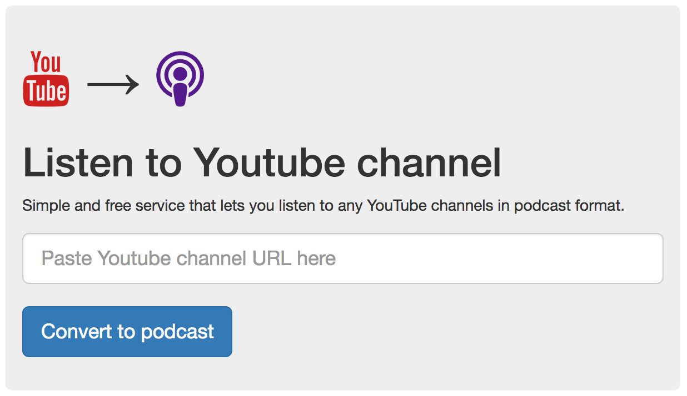

# Youtube Fetcher

[](http://youtube-fetcher.russianpulse.ru)
[](https://travis-ci.org/sergio-fry/youtube-fetcher)
[](https://codeclimate.com/github/sergio-fry/youtube-fetcher)
[](https://codeclimate.com/github/sergio-fry/youtube-fetcher/coverage)
[](https://gemnasium.com/github.com/sergio-fry/youtube-fetcher)
[](https://hub.docker.com/r/udalov/youtube-fetcher/)
[](https://github.com/sergio-fry/youtube-fetcher)

Convert Youtube channel into audio podcasts with 1 click. Free webservice is [available](http://youtube-fetcher.russianpulse.ru). With *YF* you can listen to your favorite Youtube channels as audio podcasts offline. Choose any podcast player you want.

Try [Youtube Fetcher](http://youtube-fetcher.russianpulse.ru/) online.



## Features

|          |  Youtube Fetcher                        |
|----------|-----------------------------------------|
:sparkles: | Build Atom feed podcast by a channel ID
:rocket:   | Background media download
:radio:    | Video converted into MP3 audio
:ship:     | Ships as a Docker image
:metal:    | It's a Ruby on Rails application
:+1:       | Well tested

## Example

Let's turn [TEDx Talks into](https://www.youtube.com/channel/UCsT0YIqwnpJCM-mx7-gSA4Q) *podcast*:

http://youtube-fetcher.russianpulse.ru/channels/UCsT0YIqwnpJCM-mx7-gSA4Q


## Setup

```bash
docker run -e RAILS_ENV=production -e SECRET_KEY_BASE=ABC123 -p 3000:80 -t udalov/youtube-fetcher web
```

Open browser:

http://0.0.0.0:3000/

## License

Youtube Fetcher is released under the MIT [License](http://www.opensource.org/licenses/MIT).
